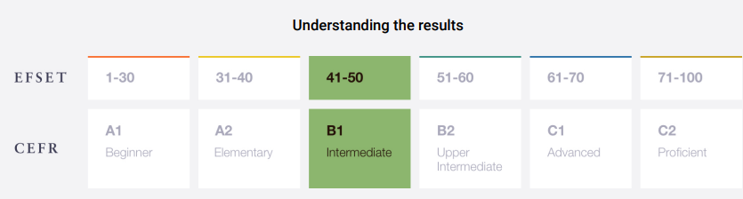

# Mikula Anna


## Contact information:

**Phone:** +38 097 1964985<br>
**E-mail:** mikula.v.anna@gmail.com<br>
[LinkedIn](https://www.linkedin.com/in/ганна-мікула-147943237/)<br>
[GitHub](https://github.com/AnnaMikula03)

---

### About Me:

Work experience as a lead engineer at METINVEST Group enterprises. My goal is to become a web developer. I want to radically change my life and acquire new knowledge that will help me become a highly qualified specialist in the IT field in the future.

My strengths: responsibility, punctuality, patience, flexibility, ability to work in a team.

---

### Skills:

- HTML5, CSS3, SACSS
- JavaScript Basics
- Git, GitHub
- VS Code
- Figma

---

### Code example:

**Peak array index KATA from CODEWARS:**
_Given a string, you have to return a string in which each character (case-sensitive) is repeated once._

```javascript
function doubleChar(str) {
  let result = "";
  for (let i = 0; i < str.length; i++) {
    result += str[i].repeat(2);
  }
  return result;
}
```

---

### Education:

- **University:** Priazovsky State Technical University, electrical systems of power consumption, master's degree (with honors)
- **Courses:**
  - Udemy [Javascript](https://www.udemy.com/course/javascript-ru/)
  - QA Manual from GlobalLogic
  - Front-end development from Prometheus
  - RS Schools Course «JavaScript/Front-end. Stage 0» (in progress)

---

### Languages:

- English \- B1 Intermediate (according to the online test at [www.efset.org](https://www.efset.org/quick-check))<br>
  
- Ukrainian \- Native
- Russian \- Fluency
